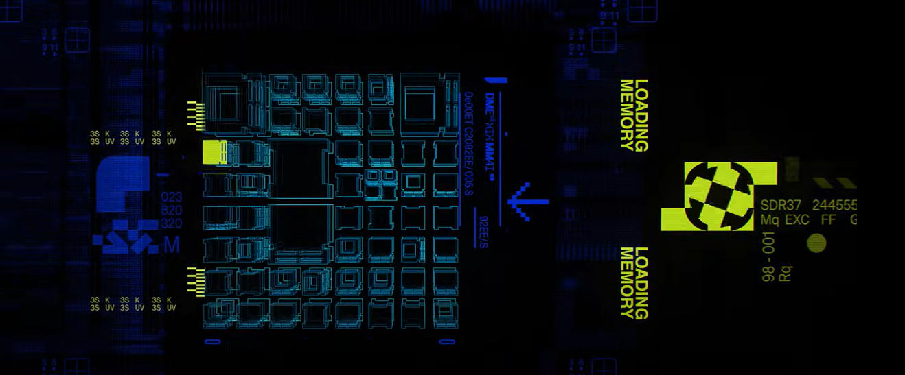

# Week 9 Quiz

### Part 1: Imaging Technique Inspiration
The project im taking inspiration from is the [Marathon Alpha Intro cinematic](https://www.youtube.com/watch?v=N4Jv5H3_yAo) as it shows an interesting fusion of glitch aesthetics and holographic overlays which creates a dynamic and immersive visual experience. I think it would be interesting to implement these ideas in regards to the assignment as it could combine the futuristic imaging style the cinematic to the antiquated context of the example paintings. 

### Part 2: Coding Technique Exploration
An example of a coding technique which could assist in creating this form of imagery in p5 could be the blendMode() function. This function allows for the combination of images and colours with blending forms which could help create the futuristic overlapping visuals seen the cinematic. 
An example of this function in use is in the creation of [this visual illusion](https://www.youtube.com/watch?v=NDn7y4nWekE) similar in the style I'm aiming to capture. 
